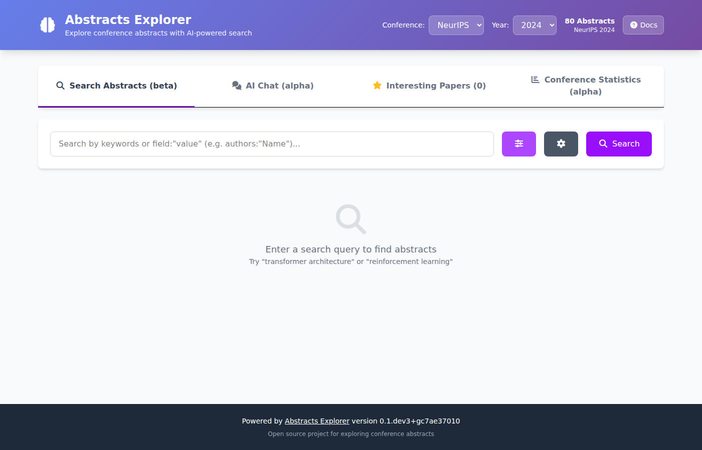

# Abstracts Explorer Documentation

Welcome to the documentation for Abstracts Explorer! This package provides tools for downloading, storing, and analyzing conference paper abstracts using LLM-based semantic search.

## Web Interface

Abstracts Explorer includes a browser-based UI for searching, chatting, rating,
and visualizing conference abstracts.



The interface provides four tabs — **Search**, **AI Chat**, **Interesting Papers**,
and **Clusters** — described in detail in the [Web Interface guide](web_ui.md).
A live demo is available at [abstracts.hzdr.de](https://abstracts.hzdr.de).

## Features

- **Download conference abstracts** from multiple sources (NeurIPS, ICLR, ICML, and more via plugins)
- **Plugin system** for downloading from workshops and other conferences
- **Store abstracts** in a SQL database (SQLite or PostgreSQL) with full metadata
- **Create vector embeddings** for semantic search
- **Cluster and visualize** paper embeddings with multiple algorithms
- **MCP server** for LLM-based cluster analysis and topic exploration
- **RAG (Retrieval-Augmented Generation)** chat interface for querying papers
- **Web interface** for browsing and searching papers
- **Registry support** for sharing paper databases and embeddings between instances via OCI registries (e.g. ghcr.io)
- **Command-line interface** for easy interaction
- **Configuration system** with .env file support

## Quick Start

Install the package:

```bash
# Install uv if you haven't already
curl -LsSf https://astral.sh/uv/install.sh | sh

# Install the package with all dependencies
uv sync --all-extras
```

Download conference abstracts:

```bash
# Download abstracts for a specific conference and year
uv run abstracts-explorer download --year 2025

# Or download from a workshop using plugins
uv run abstracts-explorer download --plugin ml4ps --year 2025
```

Alternatively, download pre-built data from an OCI registry (no LLM backend required):

```bash
uv run abstracts-explorer registry download \
  -r ghcr.io/thawn/abstracts-data \
  --conference neurips --year 2025
```

Create embeddings for semantic search:

```bash
uv run abstracts-explorer create-embeddings
```

Search papers:

```bash
uv run abstracts-explorer search "machine learning"
```

Chat with papers using RAG:

```bash
uv run abstracts-explorer chat
```

## Documentation Contents

```{toctree}
:maxdepth: 2
:caption: User Guide

web_ui
usage
docker
installation
configuration
registry
plugins
cli_reference
mcp_server
```

```{toctree}
:maxdepth: 2
:caption: API Reference

api/modules
api/database
api/embeddings
api/clustering
api/rag
api/config
api/plugin
api/registry
api/mcp_server
api/mcp_tools
api/export_utils
api/paper_utils
api/db_models
api/evaluation
```

```{toctree}
:maxdepth: 1
:caption: Development

contributing
branching_strategy
architecture
```

## Indices and tables

* {ref}`genindex`
* {ref}`modindex`
* {ref}`search`
