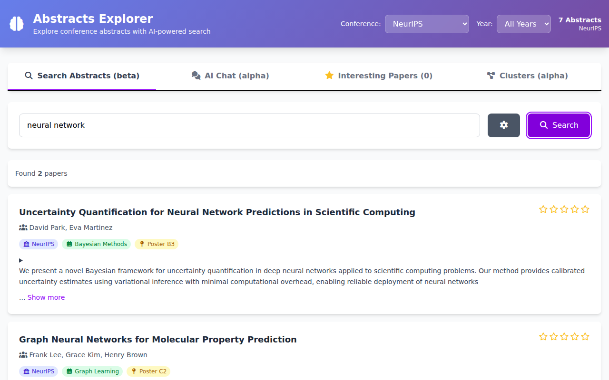
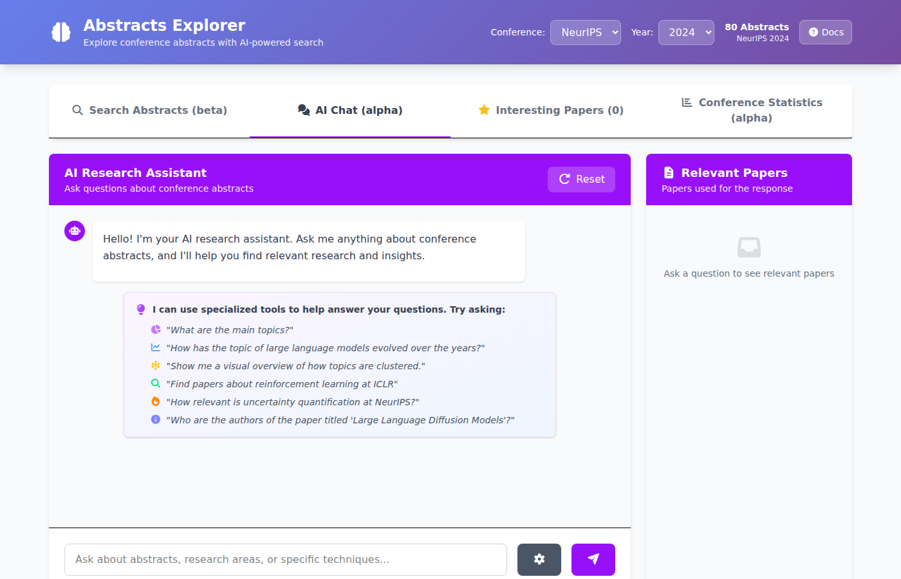
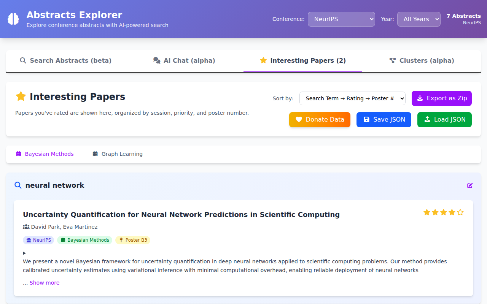
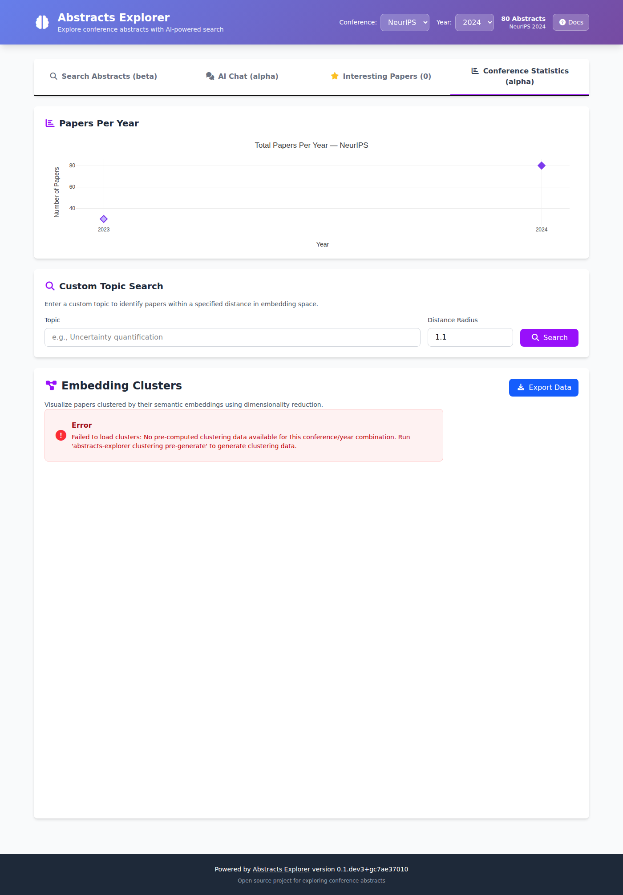

# Web Interface

Abstracts Explorer includes a browser-based interface for searching, chatting, rating,
and visualizing conference abstracts.

A live demo is available at [abstracts.hzdr.de](https://abstracts.hzdr.de).


The interface has four tabs. A **header bar** at the top lets you switch conference
and year; the selected filters apply to every tab. Click the **Help** button in the
header to open this documentation page.

> **Prerequisites:** You need to have downloaded papers first
> (`abstracts-explorer download`) and, for semantic search and AI Chat, created
> embeddings (`abstracts-explorer create-embeddings`).

## Search Abstracts



The default tab. Type a query and press **Search** to find matching papers.

**How to search:**

- **Keyword or semantic search** — type any topic or phrase (e.g.
  `"uncertainty quantification"`) and press **Search**. Results are ranked by
  AI-powered similarity when embeddings are available.
- **Field search** — narrow results to a specific field using
  `field:"value"` syntax, e.g. `authors:"Jane Smith"` or `title:"transformer"`.
  Field searches work without an embedding model.
- **Advanced Search** — click the **sliders button** (⚙ icon with sliders) next to
  the search bar to open a form where you can fill in topic, authors, title,
  keywords, abstract, and award fields separately.
- **Settings** — click the gear button to choose how many results to show
  (10 / 25 / 50 / 100) and to filter by session or track.
- **Conference / Year filter** — use the header dropdowns to restrict results
  to a specific conference and year.

**Rating papers:** Click the stars on any paper card to rate it (1–5 stars).
Rated papers are automatically saved to the *Interesting Papers* tab.

## AI Chat



An AI assistant that answers questions about the loaded abstracts using
Retrieval-Augmented Generation (RAG).

**How to use it:**

1. Type a question in the input box at the bottom and press Enter or click the
   send button.
2. The assistant retrieves relevant abstracts, uses them as context, and
   generates an answer.
3. The **Relevant Papers** panel on the right (or the *View Papers* button on
   mobile) shows which abstracts were used.
4. Ask follow-up questions — the assistant remembers the conversation.
5. Click **Reset** to start a fresh conversation.

**Settings** (gear icon): choose how many abstracts to include as context
(3–50) and filter by session/track.

**Specialized tools:** The assistant can automatically call built-in analysis
tools when you ask certain questions — you do not need to do anything special:

| Tool | What it does | Example prompt |
|------|-------------|----------------|
| `analyze_topic_relevance` | Scores how prominent a topic is across conferences | *"How important is uncertainty quantification?"* |
| `get_topic_evolution` | Tracks year-over-year changes in a topic | *"How has research on diffusion models evolved?"* |
| `search_papers` | Finds the most relevant papers for a topic | *"Show me top papers on RLHF at NeurIPS"* |
| `get_paper_details` | Returns full metadata for a specific paper | *"Who are the authors of 'PICProp'?"* |
| `get_conference_topics` | Lists the main research clusters at a conference | *"What are the main topics at ICLR 2025?"* |
| `get_cluster_visualization` | Describes the 2-D cluster layout | *"Describe the cluster layout for NeurIPS 2024"* |

See [Chat Example](chat_example.md) for a full worked example conversation.

## Interesting Papers



A personal reading list of papers you have starred.

**How it works:**

- Rate a paper with stars (in the Search tab) and it appears here automatically.
- Papers are grouped by session/track using sub-tabs.
- Use the **Sort by** dropdown to reorder by search term, rating, or poster number.

**Export and share:**

- **Export as Zip** — download a ZIP archive containing one Markdown file per
  paper with title, authors, abstract, and your notes.
- **Save JSON** — save your full list (including ratings) as a JSON file.
- **Load JSON** — import a previously saved JSON to restore your list on
  another device or browser.
- **Donate Data** — optionally share your anonymized ratings to help improve
  the service.

## Conference Statistics



An overview of the loaded conference data and an interactive visualization of
paper topics.

### Papers Per Year

A bar chart showing how many papers are in the database for each year of the
selected conference. Useful for a quick overview of the dataset.

### Custom Topic Search

Enter any topic (e.g. `"graph neural networks"`) and click **Search** to find
all papers within a specified embedding-space distance of that topic. The
results appear highlighted on the cluster plot and a **Topic Evolution** chart
shows how that topic's paper count changed year over year.

> **Requires embeddings** — this feature only works after running
> `abstracts-explorer create-embeddings`.

### Embedding Clusters

An interactive 2-D scatter plot where each dot is a paper, colored by
automatically identified topic cluster.

- **Hover** over a dot to see the paper title.
- **Click** a dot to view full paper details below the plot.
- **Click** a cluster name in the legend to highlight that cluster.
- **Export Data** — download the raw clustering JSON for further analysis.

> **Requires pre-generated clusters** — run
> `abstracts-explorer clustering pre-generate` before using this view.

## Starting the Web UI

### Quick Start

**1. Start the server:**

```bash
abstracts-explorer web-ui
```

**2. Open your browser** at <http://127.0.0.1:5000>.

### Command-line options

```bash
abstracts-explorer web-ui [OPTIONS]
```

| Option | Description |
|--------|-------------|
| `--host TEXT` | Bind address (default: `127.0.0.1`) |
| `--port INTEGER` | Port number (default: `5000`) |
| `--dev` | Use Flask development server instead of Waitress |
| `-v` / `-vv` | Increase log verbosity |

### Docker / Podman

See the [Docker Guide](docker.md) for running the docker container.
