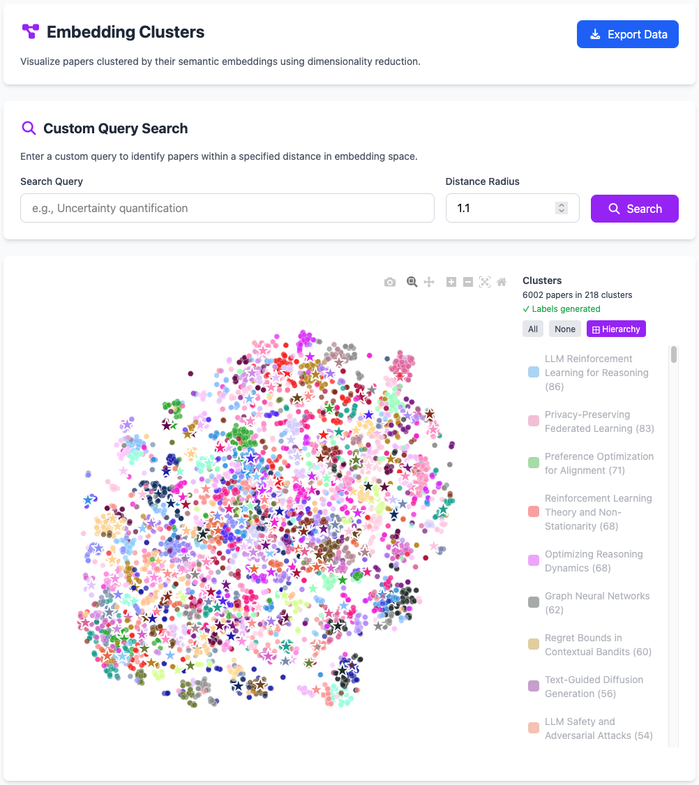

# Web Interface

Abstracts Explorer ships with a browser-based UI for searching, chatting, rating,
and visualizing conference abstracts. Start it with:

```bash
abstracts-explorer web-ui          # production (Waitress)
abstracts-explorer web-ui --dev    # development (Flask debug server)
```

Then open <http://127.0.0.1:5000> in your browser.

A live demo is available at [abstracts.hzdr.de](https://abstracts.hzdr.de).


The interface is organized into four tabs described below. A **header bar** at
the top lets you filter globally by conference and year; the selected filters
apply to every tab.

## Search Abstracts


The default tab. Type a query and press **Search** to find matching papers.

**Features:**

- **Semantic search** — results are ranked by AI-powered similarity using
  embeddings.
- **Filters** — open the settings modal to narrow results by session/track.
  You can also use the global conference and year selectors in the header.
- **Results per page** — choose 10, 25, 50, or 100 results in settings.
- **Star ratings** — click the stars on any paper card to rate it (1–5).
  Rated papers automatically appear in the *Interesting Papers* tab.

**Example use-cases:**

- Search `"uncertainty quantification"` to find UQ-related papers across all
  loaded conferences.
- Filter to *ICLR 2025* in the header, then search `"vision transformer"` to
  see only that conference's results.

## AI Chat


An interactive RAG (Retrieval-Augmented Generation) assistant that answers
questions about the loaded abstracts.

**Features:**

- **Conversational interface** — ask follow-up questions; the assistant
  remembers the conversation context.
- **Relevant papers panel** — papers retrieved as context for each answer are
  displayed in a side panel (desktop) or accessible via a button (mobile).
- **MCP tool integration** — when clustering data is available, the assistant
  can automatically call clustering tools to answer questions about topics,
  trends, and developments across conferences (see [MCP tools](#mcp-tools-available-in-chat)
  below).
- **Settings** — adjust the number of abstracts used as context (3–50) and
  filter by session/track via the gear icon.
- **Feedback** — give thumbs-up/down on individual answers. You can
  optionally donate anonymized chat transcripts to help improve the service.
- **Reset** — click *Reset* to clear conversation history and start fresh.

**Example use-cases:**

- Ask *"What are the main trends in reinforcement learning?"* to get an
  AI-generated summary backed by relevant papers.
- Follow up with *"Show me the top papers on RLHF"* to drill deeper into a
  subtopic.
- Ask *"How has research on diffusion models evolved from 2022 to 2025?"* to
  trigger a trend-analysis tool call.

### MCP tools available in Chat

The AI Chat assistant can call several specialized tools behind the scenes.
You do not need to invoke them explicitly — just ask a natural-language
question and the assistant decides which tool to use.

#### analyze_topic_relevance

Measures how important a topic is by counting papers semantically close to it
in embedding space.  Returns a relevance score (percentage) and sample papers.

> **Prompt:** *"How important is uncertainty quantification?"*
>
> **Answer (excerpt):** Based on my analysis, uncertainty quantification (UQ)
> is a moderately important and growing research topic …
>
> - NeurIPS: 6.2 / 100 (311 papers out of 5 000)
> - ICLR: 3.5 / 100 (174 papers)
> - ICML: 3.7 / 100 (185 papers)
>
> *(see [Chat Example](chat_example.md) for the full conversation)*

#### get_topic_evolution

Tracks how a topic's prevalence changes year over year across one or more
conferences.

> **Prompt:** *"How has research on diffusion models evolved from 2020 to 2025?"*
>
> **Answer (excerpt):** The number of diffusion-model papers at NeurIPS grew
> from 12 in 2020 to 158 in 2025 …

#### search_papers

Finds the most relevant papers for a topic, ranked by semantic similarity.

> **Prompt:** *"Show me the top papers on uncertainty quantification at NeurIPS, ICLR, and ICML."*
>
> **Answer (excerpt):**
>
> 🔝 NeurIPS — *Single Model Uncertainty Estimation via Stochastic Data
> Centering* (2022), *PICProp: Physics-Informed Confidence Propagation* (2023) …
>
> 🔝 ICLR — *ValUES: Systematic Validation of Uncertainty Estimation in
> Semantic Segmentation* (2024) …
>
> 🔝 ICML — *SDE-Net: Equipping Deep Neural Networks with Uncertainty
> Estimates* (2020) …
>
> *(see [Chat Example](chat_example.md) for the full list)*

#### get_paper_details

Retrieves full metadata (authors, abstract, URL, PDF link, session, keywords,
award) for a paper looked up by title or identifier.

> **Prompt:** *"Give me details about the paper 'PICProp'."*
>
> **Answer (excerpt):** *PICProp: Physics-Informed Confidence Propagation for
> Uncertainty Quantification* — NeurIPS 2023, authors: …, session: Poster
> Session 4 …

#### get_conference_topics

Lists the main research clusters at a conference with representative keywords
and example paper titles.

> **Prompt:** *"What are the main topics at ICLR 2025?"*
>
> **Answer (excerpt):** The main clusters are: (1) Large Language Models &
> Alignment, (2) Diffusion & Generative Models, (3) Graph Neural Networks …

#### get_cluster_visualization

Returns pre-computed 2-D cluster coordinates suitable for plotting.  This is
used internally by the Clusters tab but the chat can also describe
visualization data on request.

> **Prompt:** *"Describe the cluster layout for NeurIPS 2024."*
>
> **Answer (excerpt):** The visualization contains 3 200 papers in 12
> clusters.  The largest cluster (18 %) is *Optimization & Training* …

## Interesting Papers


A personal reading list of papers you have rated.

**Features:**

- **Automatic collection** — every paper you rate with stars (in the Search
  or Chat tabs) is added here.
- **Sorting** — sort by search term, rating, or poster number using the
  dropdown.
- **Session sub-tabs** — papers are organized by session/track for easy
  browsing.
- **Export** — download your collection as a ZIP archive (with Markdown
  files) or as a JSON file.
- **Import** — load a previously saved JSON file to restore your list on
  another device or browser.
- **Donate data** — optionally share your anonymized ratings to help improve
  the service.

**Example use-cases:**

- Rate papers while browsing search results, then switch to this tab to
  review your shortlist before a conference poster session.
- Export the list as a ZIP to share an annotated reading list with
  colleagues.

## Clusters



Interactive 2-D visualization of paper embeddings grouped by topic.

**Features:**

- **Scatter plot** — each dot represents a paper; colors indicate
  automatically identified topic clusters. Hover over a dot to see the
  paper title; click to view full details below the plot.
- **Legend** — cluster names (generated via TF-IDF keywords or LLM labeling)
  are listed alongside the plot. Click a cluster name to highlight it.
- **Custom query search** — enter a free-text query and a distance radius to
  highlight papers close to that query in embedding space.
- **Export** — download the raw clustering data as JSON for further analysis.

**Example use-cases:**

- Open the Clusters tab to get a bird's-eye view of research topics at a
  conference.
- Type `"graph neural networks"` in the custom query box with a distance of
  1.0 to see which papers are semantically close to that topic.
- Click on an outlier dot to discover an unusual or cross-disciplinary paper
  you might otherwise miss.

## Starting the Web UI

### Command-line options

```bash
abstracts-explorer web-ui [OPTIONS]
```

| Option | Description |
|--------|-------------|
| `--host TEXT` | Bind address (default: `127.0.0.1`) |
| `--port INTEGER` | Port number (default: `5000`) |
| `--dev` | Use Flask development server instead of Waitress |
| `-v` / `-vv` | Increase log verbosity |

### Docker / Podman

When running via Docker Compose the web UI is exposed on port 443 (https) by default.
See the [Docker Guide](docker.md) for details.
